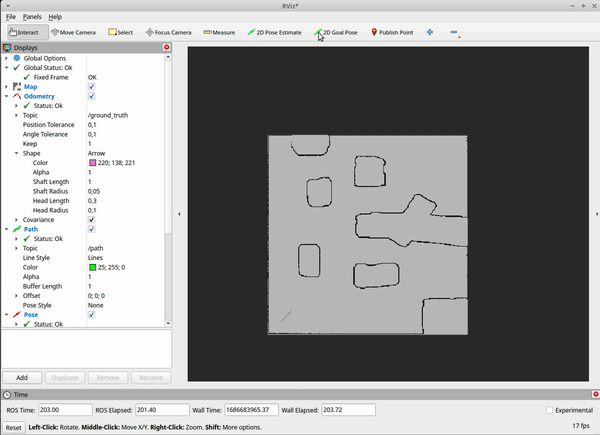
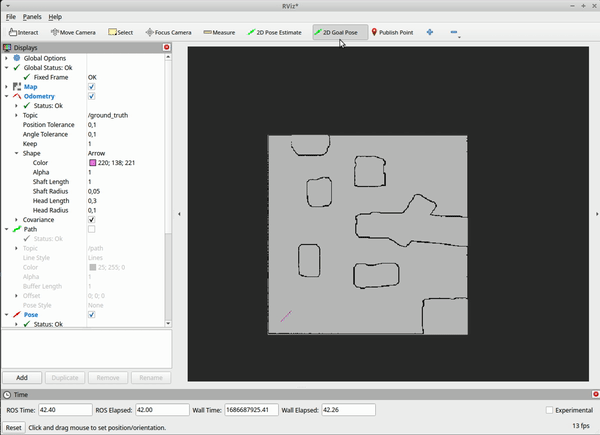
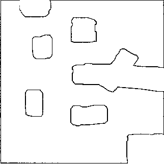
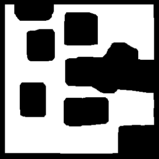
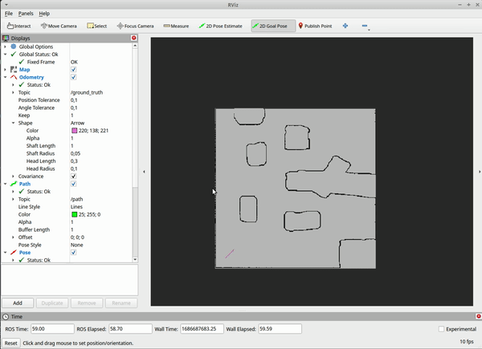

# Readme

## Go-To

**First name :** Colin - **Last Name :** Carrere - **Student ID :** 12231283

**First name :** Roland - **Last Name :** Ducros- **Student ID :** 12231858

The repo can be found [here](https://github.com/roroturbo/mr_goto/tree/main).

Implementation of a GoTo algorithm. The robot is capable to drive to user defined goal using the A* algorithm.

# Prerequisites  :

- ROS2 and the environment for the `stage_ros2` package.
- Clone the repo in your ROS directory.

# Launch :

*Warning ⚠️*  : Don’t forget to build and to check the paths on the launch file !  

We created a launch file to launch all the useful nodes in one command line.

(such as `stage_ros2` , `nav2_map_server` , `rviz2`, `nav2_lifecycle_manager`and `tf2_ros`).

*Warning ⚠️*  : The `go_to.py` must be launched **first** and separately because of slow startup initialization (at least on my computer).

```bash
# To launch the node
ros2 run mr_goto goto

# Once the node has started
ros2 launch mr_goto launch.py
```

# Usage :

Rviz is automatically opened. You just have to click on 2D pose goal and select on the map where do you want the robot to navigate to. The trajectory will be displayed and the robot will follow the trajectory and go to the correct goal pose (with correct orientation). As we are eroding the drivable area a bit to avoid the robot driving into the wall, don’t put the goal pose too near to a wall.



*Warning ⚠️*  : Rviz may not be correctly configured the first time ! You have to add and set :

- Set `Fixed frame` to `map`
- Add `Map` and set topic to `/map`
- Add `Odometry` and set topic to `/ground_truth` to see the position of the robot.
- Add `Path` and set topic to `/path` to see the generated path.
- Add `Pose` and set topic to`/goal_pose` to visualize the final pose.

## Change the map :

To change the map, you have to change in the launch file the parameters of `stage_ros2` and `nav2_map_server` to the new map that you want to use.

*Warning ⚠️*  : Relative path didn’t work for me, you may need to change the absolute path of the maps in this file.

# Documentation details

Points :

## 1. GoTo

Our planner can use our self-localization (20 Points). We just need to launch our node and change the `/ground_truth` to `/estimate_pose`. We disabled it because of my slow computer.

Our planner must be operated with Rviz (20 Points).

### **1.1 Creation of a new node : (50 Points)**

To create a new node correctly, we have to :

- First, to navigate to the workspace.
- Use this command : `ros2 pkg create --build-type ament_python mr_goto`
- The structure of the package is now generated.
- We created a python script in the directory `/mr_goto` named `goto.py`
- Then in the `setup.py`, we have to add this entry_point : `goto = mr_goto.goto:main`
- Make sure the file is executable (`chmod`)
- Now we can launch our newly created node with : `ros2 run mr_goto goto`

### 1.2 Simple, no Obstacle (50 Points)

- Our vehicle can drive to a goal location and stops there. (25 Points)
- Our vehicle can drive to a goal location, stops there and turns into the correct pose. (25 Points)

For this part we created a simple `goto_point` function. Where we calculate the desired heading and just drive trough directly at a constant speed.



### 1.4 Plan (100 Points)

For this part we use the `Occupancy Grid` of the topic `/map` to get the knowledge of the environnement, and save it in an array called map. On this array we use the package skimage of python, to detect the drivable area (use a flood_fill method), and compute a safe area (use a erode method to increase all obstacle) to permit to the robot to move without crashing in a wall.



Original Map get in /map



Safe map after flood_fill and erode

After having a safe zone where the robot can move, we use the 8-direction A* algorithm to find the shortest path between the start point (robot) and the endpoint (goal_pose). When we have this shortest path, we can publish it on the topic /path.

For follow the path we use the previous method goto_point (1.2) to follow the point in the path, and go to the end point.



As you can see the final behavior work perfectly.

## 2. Publish the used map

### 2.2 Use a published map. (45 Points)

We opted for this solution which seemed the easiest from our point of view. The difficulty resides in the `map_server` and `lifecycle_manager`.

You have to set the parameters of the `yaml_filename` (relative or absolute path) and also specify these parameters for the `lifecycle_manager`.

```python
parameters=[{'use_sim_time':True},
            {'autostart': True},
	          {'node_names': ['map_server']}
                        ])
```

As mentioned in the name, the `lifecycle_manager`handle the lifecycle of nodes. It provides a standardized way to transition nodes through different states, such as configuring, activating, deactivating, and shutting down. You can do it manually, `ros2 lifecycle set /map_server configure` , `ros2 lifecycle set /map_server activate`. But the correct way to do it is as done in the launch file.

### 3. Using Rviz (20 Points)

To set the `/goal_pose` with Rviz we listen the topic `/goal_pose` in our node `mr_goto`, as you can see in the previous gif. We also add a Pose in Rviz to display the good direction of the goal.

### 5.1 Basic Launch File (20 Points)

We implemented a basic launch file to facilitate the launch of all nodes.
